# Splunk Detection Engineering Lab

## Overview

This project focuses on detection engineering and threat hunting using Splunk Enterprise, Sysmon, and Windows Event Logs.

The objective is to create and validate detections for common attacker techniques while investigating security telemetry collected from Windows endpoints.

---

## Lab Environment

### Tools Used

- Splunk Enterprise
- Splunk Universal Forwarder
- Sysmon
- Windows Event Viewer
- Windows Command Prompt
- PowerShell

### Data Sources

- Microsoft-Windows-Sysmon/Operational
- Windows Security Logs
- Windows System Logs

---

## Detection Scenario 1: Process Creation Monitoring

### Objective

Detect and investigate newly created processes using Sysmon Event ID 1.

### Detection Query

``spl
source="WinEventLog:Microsoft-Windows-Sysmon/Operational"
EventID=1

## Investigation

Process creation events were successfully indexed into Splunk.

Several processes were generated and validated, including:

- cmd.exe
- notepad.exe
- powershell.exe

These events provided visibility into process execution activity and parent-child process relationships.

---

## MITRE ATT&CK Mapping

| Technique | ID |
|------------|------------|
| Command and Scripting Interpreter | T1059 |
| PowerShell | T1059.001 |
| Windows Command Shell | T1059.003 |

---

## Screenshots

### Sysmon Process Creation Events

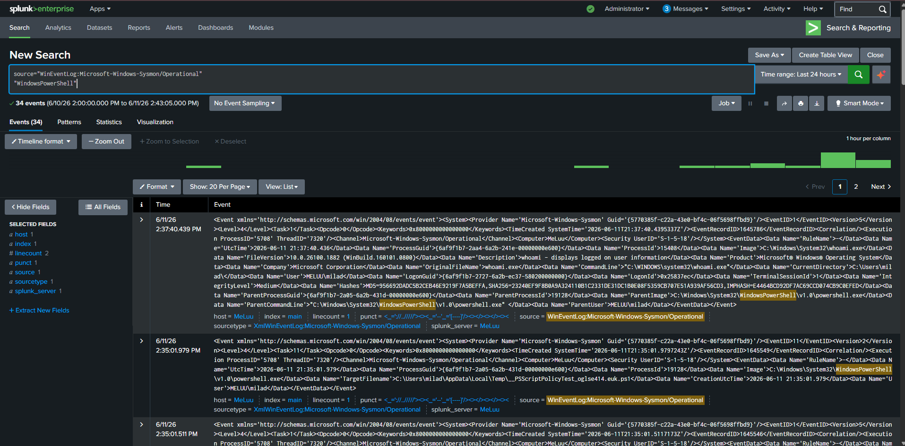

### CMD Execution Detection

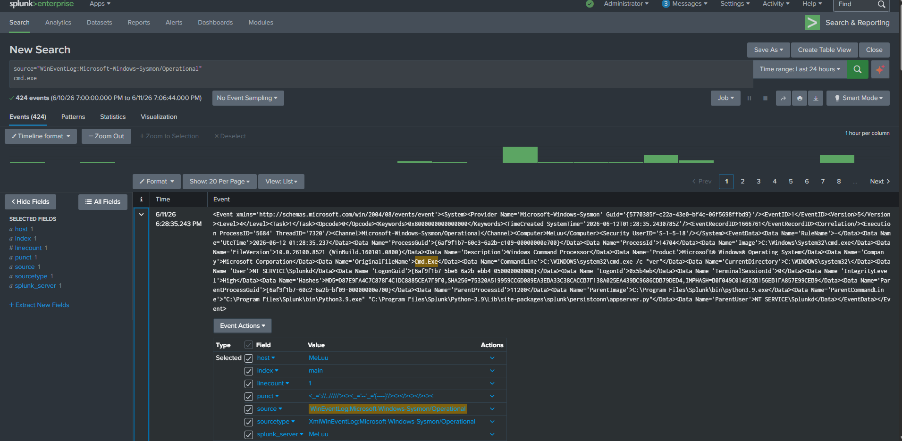

### Notepad Execution Detection

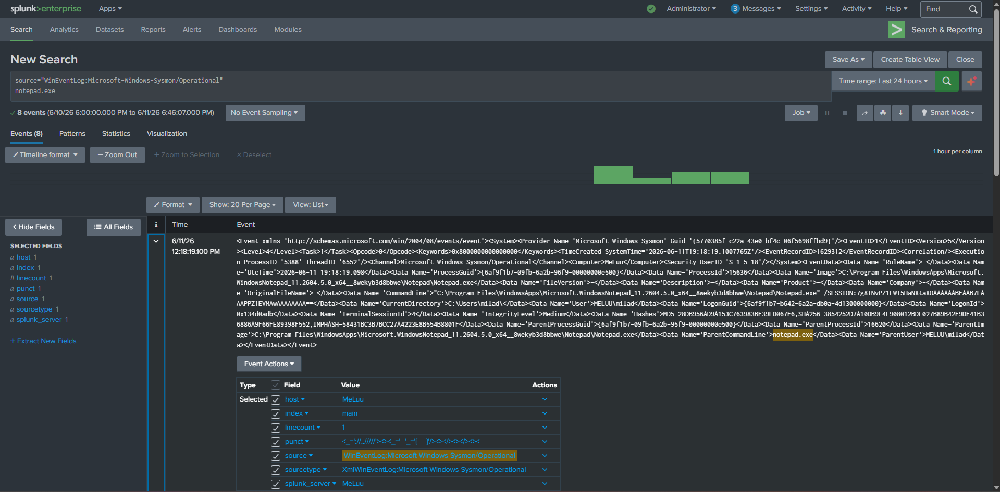

### PowerShell Execution Detection

PowerShell activity identified through Sysmon Process Creation events. The investigation shows PowerShell spawning the `whoami.exe` process, providing visibility into command execution and parent-child process relationships.

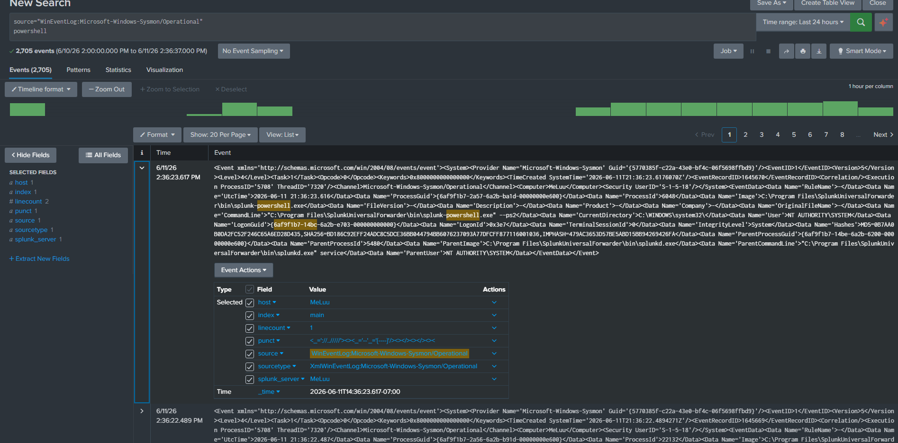


# Detection Scenario 2: Network Connection Monitoring

## Objective

Detect and investigate outbound network connections using Sysmon Event ID 3.

## Detection Query

```spl
source="WinEventLog:Microsoft-Windows-Sysmon/Operational"
"<EventID>3</EventID>"
```

## Investigation

Network connection events were successfully collected and indexed into Splunk.

Testing was performed by generating outbound network activity using web browsing and DNS lookups. Sysmon Event ID 3 telemetry was reviewed to identify:

- Source IP addresses
- Destination IP addresses
- Destination ports
- Destination hostnames
- Associated processes

The investigation confirmed successful collection of network connection events and demonstrated visibility into process-level network activity.

This visibility helps identify suspicious communications and potential command-and-control activity.

## MITRE ATT&CK Mapping

| Technique | ID |
|------------|------------|
| Application Layer Protocol | T1071 |
| Network Service Discovery | T1046 |

## Screenshots

### Network Connection Events

Network connection activity captured through Sysmon Event ID 3. The investigation identified outbound connections, destination IP addresses, destination hostnames, destination ports, and the originating process.

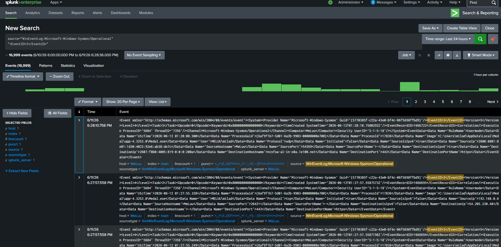


# Detection Scenario 3: DNS Monitoring

## Objective

Detect and investigate DNS queries using Sysmon Event ID 22.

## Detection Query

```spl
source="WinEventLog:Microsoft-Windows-Sysmon/Operational"
EventID=22
```

## Investigation

DNS query events were successfully collected and indexed into Splunk using Sysmon Event ID 22.

The investigation identified:

- Queried domain names
- DNS query results
- Associated processes
- User context

Analysis of Event ID 22 telemetry showed DNS requests being generated by system and application processes, providing visibility into domain resolution activity across the endpoint.

This visibility can assist with identifying suspicious domains, malware communications, and command-and-control activity.

## MITRE ATT&CK Mapping

| Technique | ID |
|------------|------------|
| Application Layer Protocol: DNS | T1071.004 |

## Screenshots

### DNS Query Investigation

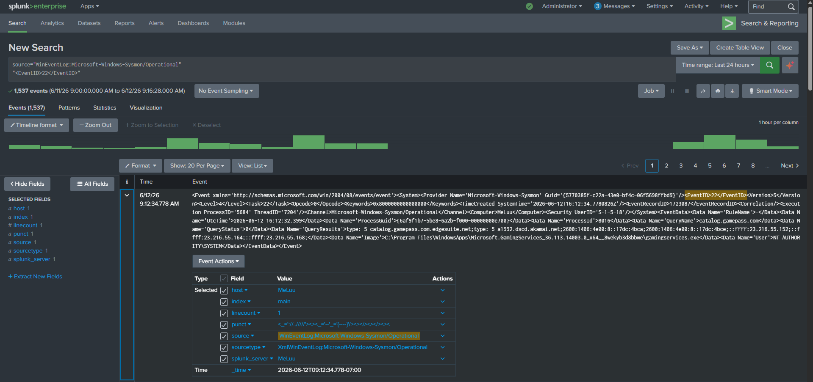


# Detection Scenario 4: Failed Logon Detection

## Objective

Detect failed authentication attempts using Windows Security Event ID 4625.

## Detection Query

```spl
source="WinEventLog:Security"
EventCode=4625
```

## Investigation

Failed logon events were successfully collected and indexed into Splunk.

The investigation identified:

- Failed authentication attempts
- Source workstation information
- Logon types
- Failure reasons and status codes

Analysis of Event ID 4625 telemetry provided visibility into unsuccessful authentication activity and can assist in identifying password spraying and brute-force attacks.

## MITRE ATT&CK Mapping

| Technique | ID |
|------------|------------|
| Brute Force | T1110 |

## Screenshots

### Failed Logon Investigation

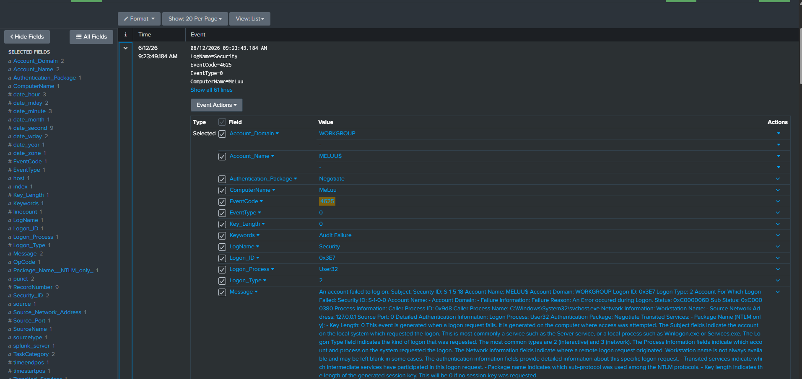


# Detection Scenario 5: Successful Logon Detection

## Objective

Detect successful authentication events using Windows Security Event ID 4624.

## Detection Query

```spl
source="WinEventLog:Security"
EventCode=4624
```

## Investigation

Successful logon events were successfully collected and indexed into Splunk.

The investigation identified:

- Authenticated user accounts
- Logon types
- Authentication packages
- Workstation information
- Security identifiers (SIDs)

Analysis of Event ID 4624 telemetry provided visibility into successful authentication activity and assisted with tracking user access across the environment.

## MITRE ATT&CK Mapping

| Technique | ID |
|------------|------------|
| Valid Accounts | T1078 |

## Screenshots

### Successful Logon Investigation

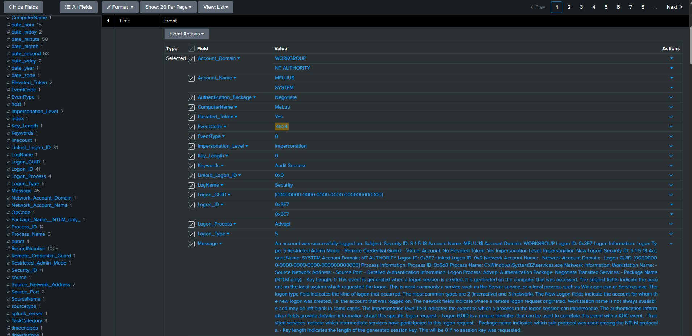


# Detection Scenario 6: Encoded PowerShell Detection

## Objective

Detect PowerShell commands executed with encoded payloads using Sysmon Event ID 1.

## Detection Query

```spl
source="WinEventLog:Microsoft-Windows-Sysmon/Operational"
"-enc"
```

## Investigation

Encoded PowerShell activity was successfully detected through Sysmon Process Creation events.

The investigation identified:

- PowerShell execution
- Encoded command-line arguments
- Parent-child process relationships
- User execution context

Analysis of encoded PowerShell activity provides visibility into a technique frequently used by attackers to obfuscate commands and evade detection.

## MITRE ATT&CK Mapping

| Technique | ID |
|------------|------------|
| PowerShell | T1059.001 |
| Obfuscated Files or Information | T1027 |

## Screenshots

### Encoded PowerShell Detection

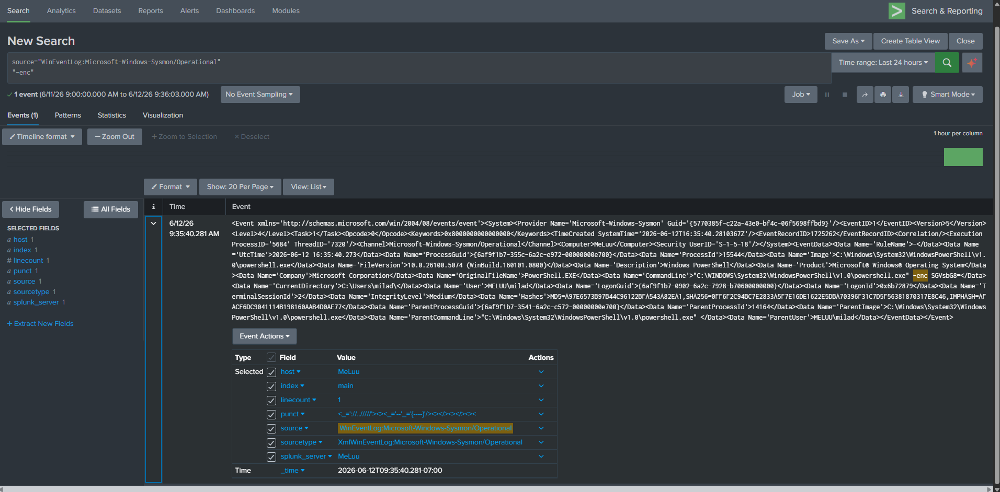


# Detection Scenario 8: New User Account Creation Detection

## Objective

Detect newly created user accounts using Windows Security Event ID 4720.

## Detection Query

```spl
source="WinEventLog:Security"
EventCode=4720
```

## Investigation

User account creation events were successfully collected and indexed into Splunk.

The investigation identified:

- Newly created user accounts
- Security identifiers (SIDs)
- Account creation timestamps
- Associated system information

Analysis of Event ID 4720 telemetry provides visibility into account creation activity and can assist in identifying unauthorized persistence mechanisms.

## MITRE ATT&CK Mapping

| Technique | ID |
|------------|------------|
| Create Account | T1136 |

## Screenshots

### New User Account Creation Investigation

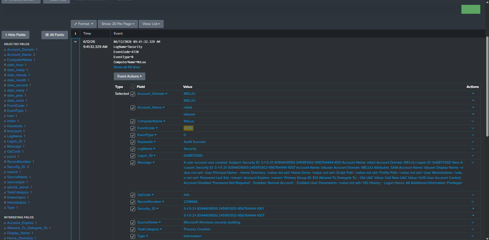


# Detection Scenario 9: Security Group Membership Changes

## Objective

Detect user accounts being added to privileged security groups using Windows Security Event ID 4732.

## Detection Query

```spl
source="WinEventLog:Security"
EventCode=4732
```

## Investigation

Security group membership modification events were successfully collected and indexed into Splunk.

The investigation identified:

- User accounts added to privileged groups
- Group names and associated permissions
- Security identifiers (SIDs)
- Account modification activity

Analysis of Event ID 4732 telemetry provides visibility into privilege escalation attempts and unauthorized account modifications.

The investigation confirmed that the user account **labuser** was added to the local **Administrators** group.

## MITRE ATT&CK Mapping

| Technique | ID |
|------------|------------|
| Account Manipulation | T1098 |

## Screenshots

### Security Group Membership Change Investigation

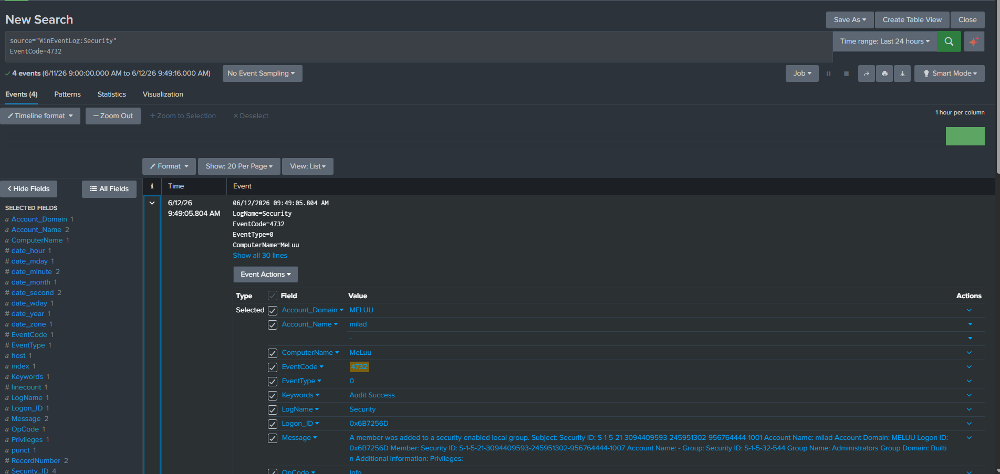


# Detection Scenario 10: PowerShell Execution Monitoring

## Objective

Detect and investigate PowerShell execution activity using Sysmon Process Creation events.

## Detection Query

```spl
source="WinEventLog:Microsoft-Windows-Sysmon/Operational"
powershell.exe
```

### PowerShell Execution Detection

PowerShell activity was identified through Sysmon Process Creation events (Event ID 1).

The investigation showed PowerShell spawning the `whoami.exe` process, providing visibility into command execution and parent-child process relationships.

This type of telemetry can assist analysts in identifying malicious PowerShell activity, post-exploitation behavior, and attacker reconnaissance techniques.

## MITRE ATT&CK Mapping

| Technique | ID |
|------------|------------|
| PowerShell | T1059.001 |
| Command and Scripting Interpreter | T1059 |

## Screenshots

### PowerShell Execution Investigation

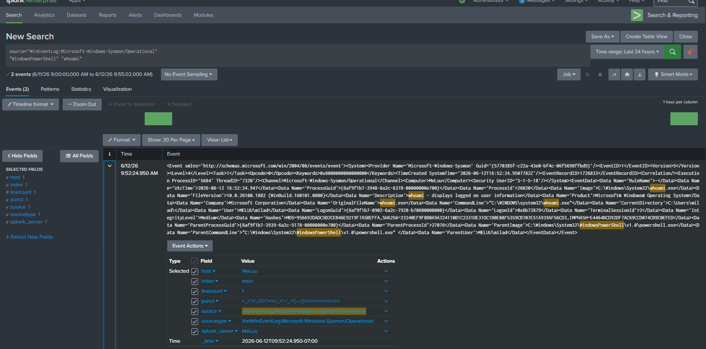


# Advanced Investigations

The following investigations build upon previously developed detections and demonstrate deeper threat hunting and incident analysis workflows using Splunk, Sysmon, and Windows Event Logs.

---

## Investigation 1: Successful Logon Analysis

### Related Detection

Detection Scenario 7: Successful Logon Monitoring

## Objective

Investigate successful authentication activity using Windows Security Event ID 4624 and identify user logon behavior occurring on the endpoint.

## Detection Query

```spl
source="WinEventLog:Security"
EventCode=4624
```

## Investigation

Successful logon events were successfully collected and analyzed within Splunk.

The investigation identified:

- Authenticated user accounts
- Interactive logon activity
- Authentication packages
- Source system information
- Logon session details

Analysis of Event ID 4624 telemetry provided visibility into successful user authentication activity occurring on the endpoint.

The investigation confirmed a successful interactive logon (Logon Type 2), demonstrating how Windows records legitimate user access and associated authentication details.

This visibility can assist analysts in identifying normal user behavior, unauthorized account usage, and potential lateral movement activity.

## MITRE ATT&CK Mapping

| Technique | ID |
|------------|------------|
| Valid Accounts | T1078 |

## Screenshots

### Successful Logon Investigation

Successful authentication activity identified through Windows Security Event ID 4624. The investigation shows an interactive logon (Logon Type 2), authentication package information, and user account details associated with the successful login event.

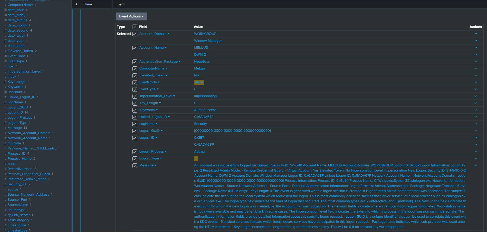


## Investigation 2: PowerShell Execution Analysis

### Related Detection

Detection Scenario 1: Process Creation Detection

## Objective

Investigate PowerShell execution activity and analyze parent-child process relationships using Sysmon Process Creation events.

## Detection Query

```spl
source="WinEventLog:Microsoft-Windows-Sysmon/Operational"
whoami.exe
```

## Investigation

PowerShell execution activity was successfully identified through Sysmon Process Creation events.

The investigation identified:

- PowerShell process execution
- Child process creation
- Command execution activity
- Parent-child process relationships

Analysis of Sysmon Event ID 1 telemetry showed PowerShell spawning the `whoami.exe` process.

This behavior demonstrates how command execution activity can be traced through process creation events and provides visibility into user and attacker actions occurring on the endpoint.

Monitoring parent-child process relationships can assist analysts in identifying suspicious PowerShell usage, attacker reconnaissance activity, and post-exploitation behavior.

## MITRE ATT&CK Mapping

| Technique | ID |
|------------|------------|
| Command and Scripting Interpreter: PowerShell | T1059.001 |
| System Owner/User Discovery | T1033 |

## Screenshots

### PowerShell Execution Investigation

PowerShell execution activity identified through Sysmon Process Creation events. The investigation shows PowerShell spawning the `whoami.exe` process, providing visibility into command execution and parent-child process relationships.

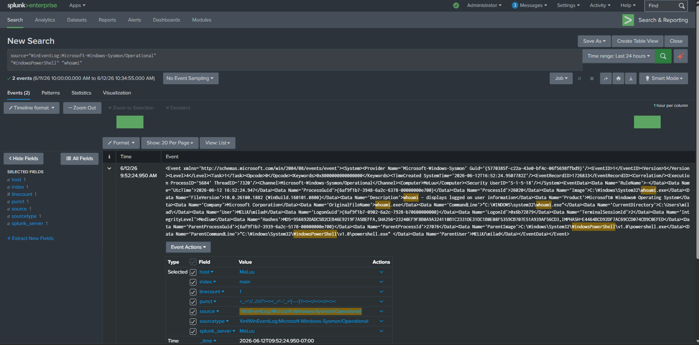


## Investigation 3: DNS Activity Analysis

### Related Detection

Detection Scenario 3: DNS Monitoring

## Objective

Investigate DNS query activity using Sysmon Event ID 22 and identify domain resolution requests generated by endpoint processes.

## Detection Query

```spl
source="WinEventLog:Microsoft-Windows-Sysmon/Operational"
EventID=22
```

## Investigation

DNS query activity was successfully identified through Sysmon DNS Query events.

The investigation identified:

- Queried domain names
- DNS query results
- Associated processes
- User context

Analysis of Sysmon Event ID 22 telemetry showed endpoint processes generating DNS requests to external domains.

This visibility enables analysts to investigate suspicious domain lookups, malware communications, and potential command-and-control activity.

## MITRE ATT&CK Mapping

| Technique | ID |
|------------|------------|
| Application Layer Protocol: DNS | T1071.004 |

## Screenshots

### DNS Activity Investigation

DNS query activity identified through Sysmon Event ID 22. The investigation shows domain resolution requests and the originating process responsible for generating the DNS query.

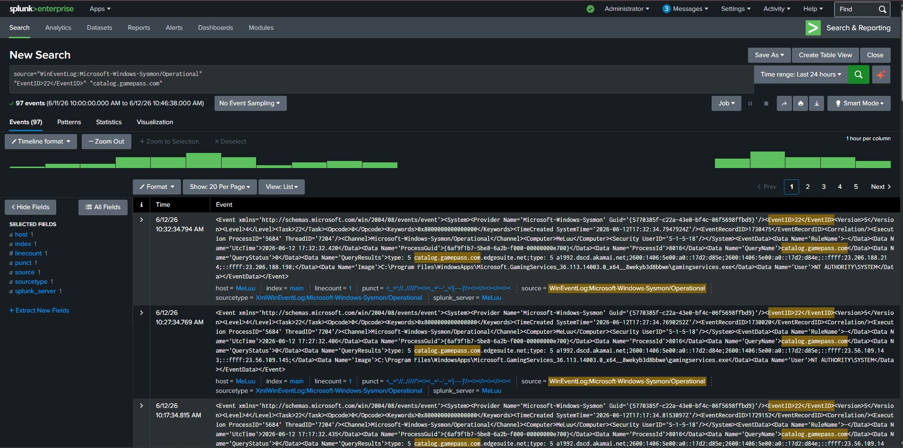


# Advanced Investigation 4: Network Connection Analysis

## Related Detection

Detection Scenario 2: Network Connection Monitoring

## Objective

Investigate outbound network connections using Sysmon Event ID 3 and correlate destination IP addresses, ports, and originating processes.

## Detection Query

```spl
source="WinEventLog:Microsoft-Windows-Sysmon/Operational"
EventID=3
```

## Investigation

Network connection events were successfully collected and indexed into Splunk using Sysmon Event ID 3.

The investigation identified:

- Source IP addresses
- Destination IP addresses
- Destination hostnames
- Destination ports
- Associated processes
- User context

Analysis of Event ID 3 telemetry provided visibility into outbound network activity occurring on the endpoint.

The investigation confirmed Discord.exe initiated a network connection to DNS. Google (8.8.8.8) over destination port 53, demonstrating how Sysmon records process-level network communications.

This visibility can assist analysts in identifying suspicious outbound connections, command-and-control activity, and unauthorized network communications.

## MITRE ATT&CK Mapping

| Technique | ID |
|------------|------------|
| Application Layer Protocol | T1071 |
| Network Service Discovery | T1046 |

## Screenshots

### Network Connection Investigation

Outbound network activity identified through Sysmon Event ID 3. The investigation shows Discord.exe communicating with dns.google (8.8.8.8) over destination port 53, providing visibility into process-level network connections and associated user context.

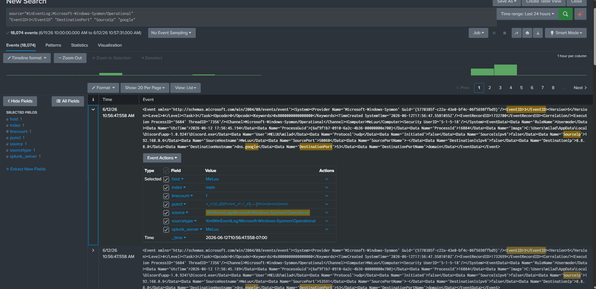

